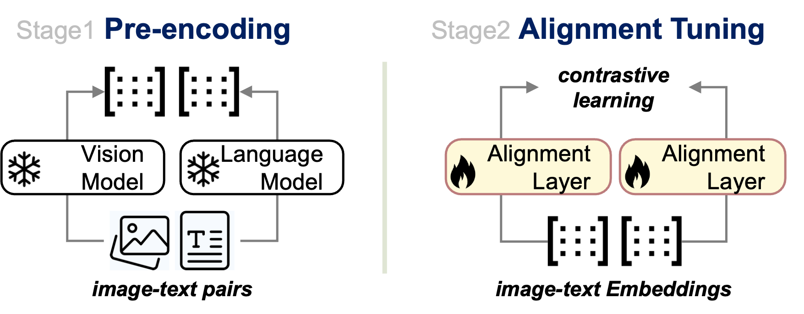
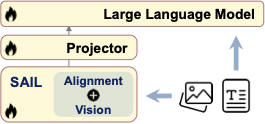

# SAIL: Swift Alignment of Image and Language

This codebase enables you to train your own CLIP-like model on a single GPU by aligning pretrained vision models, such as DINOv2, with language models like NV-Embed-2. Our approach demonstrates that training only a lightweight alignment layer while keeping the backbones frozen is sufficient to bridge the vision and language representation spaces. Using just **23M** web-collected and synthetic image-text pairs, we developed a foundational model called **SAIL-L**, which **surpasses CLIP-L (LAION400M) in vairous retrieval tasks and ImageNet** while also **serving as a strong vision encoder for building Multimodal LLMs.**  We hope this codebase serve as a useful testbed for resource-limited community to explore multimodal representation learning in terms of new losses, new data combination as well as new modality-merge strategy.

## :postal_horn: Release

- **[2024/11/20]** 🔥 **SAIL Codebase Open-Sourced!**  
  The repository now includes the complete pipeline for training data preparation and preprocessing, as well as the full training and evaluation codebase.

## :bookmark: Content

- Quick Usage
- [SAIL Training & Evaluation](#sail-training--evaluation)
  - [Data Preparation](#1-data-preparation)
  - [Training](#2-training)
  - [Evaluation](#3-evaluation)
- [SAIL Enhances SSL Models for MLLMs](#sail-enhances-ssl-models-for-mllms)
  - [LLaVA Train with SAIL](#training-with-sail-vision-encoder-in-llava-15)
  - [Evaluation](#evaluation)

## :gear: Quick Usage

1. **Clone the Repository**

   ```bash
   git clone https://github.com/lezhang7/SAIL.git
   pip install -r requirements.txt
   ```

2. **Download the Alignment Layer Checkpoint**
   You can download the pretrained alignment layer checkpoints from the links below: 

   - **SAIL DinoV2 Large with NV-Embed V2**: [sail_dinov2l_nv2.pt](https://huggingface.co/le723z/sail/resolve/main/sail_dinov2l_nv2.pt?download=true) 
   - **SAIL DinoV2 Large with GTE**: [sail_dinov2l_gte.pt](https://huggingface.co/le723z/sail/resolve/main/sail_dinov2l_gte.pt?download=true)

3. **Run the Model**

   ```python
   from model import create_model
   from PIL import Image
   import torch
   
   # Path to the downloaded checkpoint
   checkpoint_path = "checkpoint/sail_dinov2l_nv2.pt"
   
   # Create the model, change the text_model to `Alibaba-NLP/gte-large-en-v1.5` if use sail_dinov2_gte
   model = create_model(
       text_model_name="nvidia/NV-Embed-v2",
       vision_model_name="facebook/dinov2-large",
       head_weights_path=checkpoint_path,
       target_dimension=1024,
   )
   model.eval()  # Set model to evaluation mode
   
   # Prepare images and texts
   image_processor = model.image_processor
   texts = ["a dog", "a cat"]
   dog_image = Image.open("asset/dog.jpg").convert("RGB")
   cat_image = Image.open("asset/cat.jpg").convert("RGB")
   images = image_processor(images=[dog_image, cat_image], return_tensors="pt")
   
   # Generate features and probabilities
   with torch.no_grad():
       image_features = model.encode_image(images, normalize=True)
       text_features = model.encode_text(texts, text_list=texts, normalize=True)
   text_probs = (100.0 * image_features @ text_features.T).softmax(dim=-1)
   
   # Print the label probabilities
   print("Label probs:", text_probs)
   ```

## SAIL Training & Evaluation

The codebase builds upon [OpenCLIP](https://github.com/mlfoundations/open_clip) (for training SAIL) and [LLaVA](https://github.com/haotian-liu/LLaVA/tree/main) (for testing SAIL's vision encoder in MLLMs). Please ensure the necessary dependency packages for these frameworks are installed.

| **Data**    | **Model**    | **I2T R@1 (MSCOCO)** | **T2I R@1 (MSCOCO)** | **I2T R@1 (Flickr30k)** | **T2I R@1 (Flickr30k)** | **Text (Winoground)** | **Image (Winoground)** | **Group (Winoground)** | **Avg. (MMVP)** |
| ----------- | ------------ | -------------------- | -------------------- | ----------------------- | ----------------------- | --------------------- | ---------------------- | ---------------------- | --------------- |
| 23M         | SAIL-L (GTE) | 54.1                 | 42.7                 | 80.8                    | 68.9                    | 34.0                  | 13.25                  | 8.75                   | 22.2            |
| 23M         | SAIL-L (NV2) | **62.4**             | **48.6**             | **87.6**                | **75.7**                | **40.25**             | **18.75**              | **15.0**               | **28.9**        |
| *LAION400M* | *CLIP-L*     | *59.7*               | *43.0*               | *87.6*                  | *70.2*                  | *30.5*                | *11.5*                 | *8.75*                 | *20.0*          |

| Data        | Model        | Food101 | CIFAR10  | CIFAR100 | SUN397 | Cars   | Aircraft | DTD      | Pets   | Cal101   | Flowers  | Avg.   | INet     |
| ----------- | ------------ | ------- | -------- | -------- | ------ | ------ | -------- | -------- | ------ | -------- | -------- | ------ | -------- |
| 23M         | SAIL-L (NV2) | 86.1    | **96.7** | **86.7** | 69.8   | 44.6   | **28.6** | **63.5** | 82.3   | **85.4** | **77.2** | 72.1   | **73.4** |
| *LAION400M* | *CLIP-L*     | *90.1*  | *94.6*   | *77.4*   | *72.6* | *89.6* | *25*     | *60.4*   | *91.7* | *82.1*   | *75.5*   | *75.9* | *72.7*   |

---

### Data Preparation

SAIL leverages high-quality, MLLM-enhanced captions for training, using datasets introduced in [DreamLIP](https://github.com/zyf0619sjtu/DreamLIP). To streamline this process, we provide a script for automated dataset preparation. Note that this process is time-intensive, as it involves handling 23M data samples.

```bash
cd data_preparation
bash download_mllm_enhanced_data.sh
```

#### The scripts run following steps:

1. **Downloading Dataset:**  
   The script downloads `.csv` files containing image URLs and their corresponding captions for datasets such as CC3M, CC12M, and YFCC15M.

2. **Filtering Invalid Data:**  
   Since some image URLs may have expired or the images may be corrupted, the downloaded images need to be filtered. Invalid samples must also be removed from the `.csv` files.

3. **Manual Processing (Optional):**  
   As each step can take a significant amount of time, we recommend running the commands manually based on your specific requirements.

#### Updating Data Paths:

Once the preprocessing is complete, update the dataset paths including `annotation` and `imagedir` field in `data/data_config.py` :

``````python
DATADIR = {
'dreamclipcc3m': { 'annotation':f'{SCRATCH}/datasets/DownloadCC3M/cc3m_3long_1raw_captions_filterd.csv',
    'imagedir':f'{SCRATCH}/datasets/DownloadCC3M'
    }
}
``````

---

### Training

<div align=center>

</div>

The training framework of SAIL consists of two main steps: **Pre-encoding** and **Alignment Tuning**. This efficient framework allows us to align the representation space of large pretrained unimodal models (e.g., DINOv2 and NV2 models) on a single `A100` GPU with a large `batch size of 32,768`, requiring only approximately `~5 hours` of training during the alignment tuning stage.

#### stage 1. **Pre-encoding**

We provide scripts to pre-encode image-text pairs into embeddings. The script will automatically download the required model checkpoints from either [Hugging Face Transformers](https://huggingface.co/docs/transformers/index) or [TorchHub](https://pytorch.org/hub/). By default, the vision model weights will be stored in the `model/backbone_checkpoints` directory.

**Note:** Ensure your `transformers` library version is `>4.38.0` to support SDPA or FlashAttention implementations for some of the models.

##### Instructions:

- Review `scripts/encode.sh` for detailed configurations. Choose the `text_model` or `vision_model`  in `scripts/encode.sh`.
- Set the encoded domain to either `image` or `text`.  
  - If encoding text, select the caption source: `raw_caption` or high-quality captions `shortIB_captions, shortSV_captions, shortLLA_captions longIB_captions, longSV_captions, longLLA_captions`
- Execute the following command to encode the data. The embeddings will be saved in the `data/tensor_data` directory.

```bash
bash scripts/encode.sh
```

#### stage 2. **Alignment Tuning**

To train SAIL, specify the text and image embedding data by updating the `text_embedding_list` and `image_embedding_list` in `scripts/sail_train.sh`.  

- To enable multiple positive captions for contrastive loss, also update the `extra_text_embedding_list`.  
- **Important:** Ensure embeddings of the same modality are derived from the same model.

##### Training:

Run the following command to train the alignment layer:

```bash
bash scripts/sail_train.sh
```

##### Alignment Probing:

To probe the alignment, execute:

```bash
bash scripts/alignment_probing.sh
```

We only save the `alignment layer` checkpoint at `./logs/${output_name}`.

---

### Evaluation

Evaluation scripts are provided in `scripts/sail_eval.sh`.  

##### Instructions:

- Set the `vision_model`, `text_model`, and `checkpoint_path` in `scripts/sail_eval.sh`.  
  - Ensure that the vision and text models match the embedding data used to train the alignment layers.
- Prepare datasets
  - Download [MMVP_VLM](https://huggingface.co/datasets/MMVP/MMVP_VLM/tree/main) and save it to `evaluation/MMVP_VLM`
  - ImageNet and Winoground will be automatically downloadad and processed
- Specify the task from `imagenetv1 winoground MMVP` in `sail_eval.sh`, then evaluate by running:

```bash
bash scripts/sail_eval.sh
```

The evaluation results will be saved to `evaluation/eval_result/{task}`

##### Open-vocabulary semantic segmentation Instructions please refer to [here](https://github.com/lezhang7/SAIL/blob/main/evaluation/segmentation_readme.md)

## SAIL Enhances SSL Vision Models for MLLMs

SAIL significantly enhances SSL models, such as DINOv2, as vision encoders for MLLMs. Specifically, we replace the vision encoder in LLaVA-1.5 with the SAIL vision encoder, which consists of a DINOv2 backbone combined with an alignment layer. This additional alignment layer dramatically improves DINOv2's performance on MLLM tasks, even surpassing language-supervised CLIP vision encoders in certain tasks! We provide trained checkpoint at [le723z/sail-llava-v1.5-7b](https://huggingface.co/le723z/sail-llava-v1.5-7b).

<div align="center">
    
</div>


#### Table: LLaVA-1.5 with Various Vision Models

**VTune** indicates whether the vision encoder is fine-tuned during the instruction tuning stage.

| Model@224px  | VTune | SEED<sup>IMG</sup> | GQA       | VizWiz    | PoPE      | TextVQA | MMB     | VQA<sup>v2</sup> |
| ------------ | ----- | ------------------ | --------- | --------- | --------- | ------- | ------- | ---------------- |
| **DINOv2-L** | ✗     | 61.47              | 61.08     | 44.12     | 85.5      | 45.37   | 56.96   | 74.4             |
| **DINOv2-L** | ✓     | 62.12              | 61.53     | 46.59     | 85.7      | 45.92   | 58.85   | 74.69            |
| **SAIL-L**   | ✓     | **65.43**          | **62.63** | **50.00** | **86.16** | 46.53   | 60.14   | **76.77**        |
| *CLIP-L/14*  | ✗     | *64.05*            | *61.58*   | *48.87*   | *85.74*   | *54.56* | *63.06* | *75.32*          |
| *CLIP-L/14*  | ✓     | *64.15*            | *61.54*   | *49.93*   | *85.73*   | *54.18* | *64.12* | *76.36*          |

---

### Training LLaVA with SAIL Vision Encoder

We follow the LLaVA-1.5 training process, including pretraining and fine-tuning. To get started, please prepare the data following the instructions in the [original codebase](https://github.com/haotian-liu/LLaVA/tree/main?tab=readme-ov-file):

1. [Pretraining data](https://huggingface.co/datasets/liuhaotian/LLaVA-Pretrain)
2. Visual instruction tuning data

Then install the dependency packages following [here](https://github.com/haotian-liu/LLaVA/tree/main) for training llava-1.5. Recommend using `cudatoolkit/12.1.1` for reproducibility.

#### Pretraining SAIL with LLaVA-1.5

Specify `data_path` and `image_folder` for the dataset configuration. Set `vlhead_weights_path` and `vision_tower` for SAIL-LLaVA as follows:

```bash
deepspeed llava_train/train_mem.py \
    --deepspeed llava_train/zero2.json \
    --model_name_or_path lmsys/vicuna-7b-v1.5 \
    --version plain \
    --data_path blip_laion_cc_sbu_558k.json \
    --target_dimension 1024 \
    --linear_type star \
    --image_folder llava-v1.5-7b/pretrain_data \
    --vision_tower facebook/dinov2-large \
    --mm_projector_type mlp2x_gelu \
    --tune_mm_mlp_adapter True \
    --mm_vision_select_layer -2 \
    --mm_use_im_start_end False \
    --mm_use_im_patch_token False \
    --num_train_epochs 1 \
    --per_device_train_batch_size 64 \
    --per_device_eval_batch_size 4 \
    --gradient_accumulation_steps 2 \
    --evaluation_strategy "no" \
    --save_strategy "steps" \
    --save_steps 4000 \
    --save_total_limit 1 \
    --learning_rate 0.001 \
    --weight_decay 0.0 \
    --warmup_ratio 0.03 \
    --lr_scheduler_type "cosine" \
    --logging_steps 1 \
    --tf32 True \
    --fp16 False \
    --bf16 True \
    --model_max_length 2048 \
    --gradient_checkpointing True \
    --dataloader_num_workers 4  \
    --lazy_preprocess True \
    --report_to wandb  \
    --vlhead_weights_path logs/sail_l_nv2_merged23m/checkpoints/64.pt \
    --tune_alignment_layer False \
    --output_dir ./llava_checkpoints/sail_llava_pretrain
```

#### Fine-Tuning SAIL with LLaVA-1.5

For fine-tuning, update the `data_path` and other configurations. Use the following command:

```bash
deepspeed llava_train/train_mem.py \
    --deepspeed llava_train/zero3.json \
    --model_name_or_path lmsys/vicuna-7b-v1.5 \
    --version v1 \
    --data_path $dataset/llava-v1.5-7b/instruct_tuning_data/llava_v1_5_mix665k.json \
    --image_folder $dataset/llava-v1.5-7b/instruct_tuning_data/data \
    --target_dimension 1024 \
    --linear_type star \
    --vision_tower facebook/dinov2-large \
    --mm_projector_type mlp2x_gelu \
    --mm_vision_select_layer -2 \
    --mm_use_im_start_end False \
    --mm_use_im_patch_token False \
    --image_aspect_ratio pad \
    --group_by_modality_length True \
    --bf16 True \
    --num_train_epochs 1 \
    --per_device_train_batch_size 16 \
    --per_device_eval_batch_size 4 \
    --gradient_accumulation_steps 2 \
    --evaluation_strategy "no" \
    --save_strategy "steps" \
    --save_steps 400 \
    --save_total_limit 1 \
    --learning_rate 2e-5 \
    --weight_decay 0. \
    --warmup_ratio 0.03 \
    --lr_scheduler_type "cosine" \
    --logging_steps 1 \
    --tf32 True \
    --model_max_length 2048 \
    --gradient_checkpointing True \
    --dataloader_num_workers 4 \
    --lazy_preprocess True \
    --report_to wandb \
    --vlhead_weights_path llava_checkpoints/sail_llava_pretrain/vlhead.bin \
    --pretrain_mm_mlp_adapter llava_checkpoints/sail_llava_pretrain/mm_projector.bin \
    --tune_alignment_layer True \
    --unlock_vision_tower True \
    --output_dir ./llava_checkpoints/sail_llava_finetune
```

---

### Evaluation

We provide evaluation scripts in `scripts/llava_eval_scripts`. Download the evaluation dataset following [here](https://github.com/haotian-liu/LLaVA/blob/main/docs/Evaluation.md) and update the dataset path for each task bash script, then run the evaluation to test the model's performance.  

## Acknowledgement

This project is based on [open_clip](https://github.com/mlfoundations/open_clip/tree/main), [DreamLIP](https://github.com/zyf0619sjtu/DreamLIP) and [LLaVA](https://github.com/haotian-liu/LLaVA/tree/main) , we appreicate their great work!

